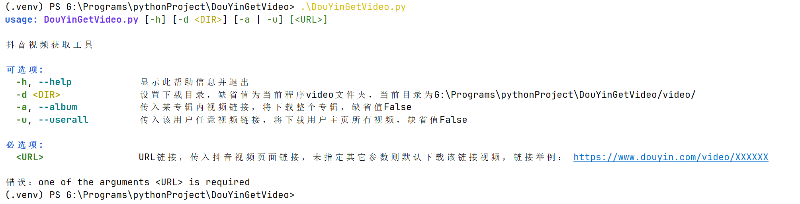

# DouYinGetVideo
用于下载抖音视频
# 抖音视频爬虫（仅个人非商业学习研究）
## 项目说明
本项目仅为Python爬虫技术、数据分析技术的学习演示案例，不保证数据抓取的稳定性、有效性及合规性。
### 1、使用方法

#### 效果图

### 2、注意事项
#### ▶环境准备
基于驱动chrome完成下载，需要将chrome浏览器及其驱动放入到文件夹chrome。\
驱动官方下载地址：https://googlechromelabs.github.io/chrome-for-testing/

#### ▶不足之处
- ##### ⨉ 人机验证
    由于抖音平台会在网页刚打开过程中跳出验证码进行人机验证，该部分需要人工手动介入。
- ##### ⨉ 主页视频下载尚未完善
- ##### ⨉ 下载的视频命名问题尚未完善
    当前为将下载的视频文件名（ID数字）与视频名称及视频链接放在当前目录中的CSV文件中
##### 待续。。。

\
\
\
\
\
\
\
\
\
\
\
\

## 版权与使用约束
1.  **版权归属**：本项目代码版权归 [gtyphoon] 所有，受《中华人民共和国著作权法》及相关国际公约保护。
2.  **严格禁止商用**：本代码仅允许个人非商业性学习、研究使用，禁止任何形式的商业用途，包括但不限于：
    - 出售本代码或基于本代码修改后的衍生代码；
    - 利用本代码抓取抖音数据进行盈利性变现（如售卖数据、引流获利、广告推广等）；
    - 为企业、机构或第三方提供抖音爬虫相关服务以获取报酬；
    - 将本代码嵌入商业产品、工具、平台中进行分发或运营使用。
3.  **合规使用要求**：
    - 使用本代码必须严格遵守抖音《用户服务协议》《robots.txt》及相关法律法规（《网络安全法》《数据安全法》《个人信息保护法》）；
    - 禁止利用本代码抓取他人隐私数据、规避平台反爬机制、进行恶意攻击或批量干扰抖音平台正常运营的行为。

## 免责声明（核心自我保护）
1.  任何个人或组织因违反本声明、相关法律法规或抖音平台协议，使用本代码产生的一切法律责任、经济损失、商誉损失，均由使用者自行独立承担，与本代码作者无关。
2.  作者不对本代码的使用效果、数据安全性、合规性做任何明示或暗示的担保，不承担任何因使用本代码引发的连带追责、索赔或其他相关责任。
3.  作者有权随时修改本声明内容，修改后的声明自发布于本仓库之日起生效。
